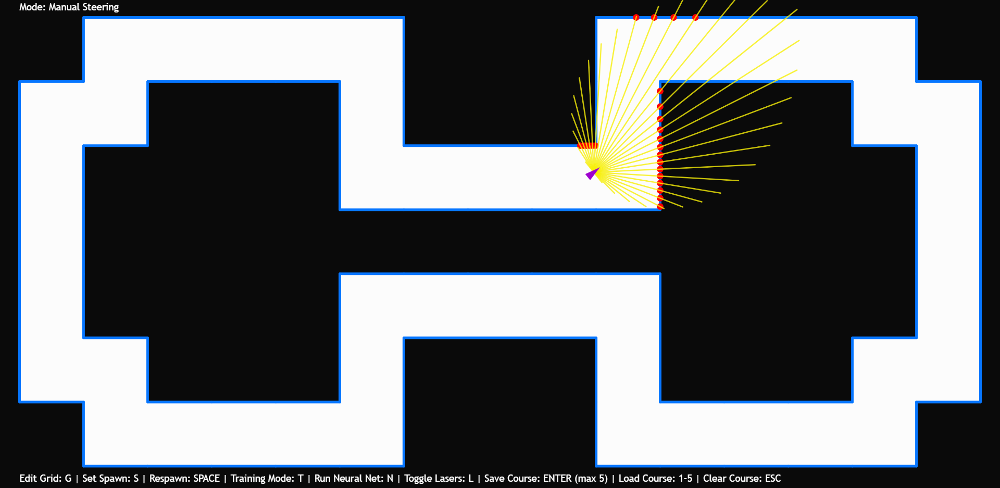

# neural-driving
Using the p5.js framework and brain.js library to visualise a neural network helping a driving agent successfully steer around a course, after being trained on the user's driving data.

# Initial
On starting the application, you will be presented in "Grid Editing" mode. This mode allows you to create custom paths given a grid of cells - this grid defaults to being 15 cells across, and an appropriate number of cells down to fill the screen. Additionally, the default spawn for the driving agent is the top-left cell. The application allows grid configurations to be saved and loaded (locally to the session), and provides two configurations by default which can be loaded by pressing the "1" and "2" numerical keys.

# Basic Track
You can then create a custom track, such as the one shown here - one of the default tracks. Left-clicking on a grid cell will toggle it between a black empty cell and a white track cell, the edges of which are coloured blue and have collision. The spawn has been adjusted to be within the track using the "S" key.

# Sensors
Leaving the "Grid Editing" mode with the "G" key, you are free to manoeuvre using the directional arrow keys. Pressing the "L" key toggles the display of the driving agent's sensors. Note this only toggles their visibility - they are still calculated when turned off. The 31 (by default) sensors can intersect with edges of the track, which is identified by a red dot. The driving agent can therefore determine the distance between itself and the environment in each of those 31 directions. These are used for collision detection in the case of crash, but also as inputs to a neural network.

# Collecting Training Data
Now that a track has been defined, we now want to produce a neural network that knows how to manoeuvre around it (and any other track) without crashing. In order to do this, we first need to collect data to train the neural network on. Pressing "T" enters the "Collecting Training Data" mode where this can happen, also displaying a small "T" within the driving agent. Whilst in this mode, every 4 animation frames, the application is observing the distances between itself and the environment in the direction of each sensor and storing this data as a 31-item array. The application then observes which directional arrow keys are being pressed in that moment (ignoring the "DOWN" arrow key for simplicity) and stores this information as a 3-item array. These two arrays are then stored together (as a single "training instance") and the process repeats until this mode is exited. Each 31-item array of sensor readings will be treated as a neural network input, and each corresponding 3-item array of directional arrow key booleans will be treated as the corresponding "correct" output for the neural network to predict. The application comes with an array of approximately 9000 of these training instances (about 10 minutes of driving around a course) for the sake of user convenience.

# Training the Neural Network
After collecting enough training data, leaving "Collecting Training Data" mode by pressing "T" again will create a neural network and subsequently begin training it on the collected training data. Depending on the amount of data and performance of the device running the application, this may take a while. It is performed as a blocking process instead of asynchronously, as the asynchonrous method proved pointless and too detrimental to animation performance. Therefore the application will seem to freeze until the training completes. From my experience, training the network on the aforementioned preloaded 9000 training instances takes under one minute to complete.

During this process, the brain.js function training the neural network will output information to the console. It trains the network by iterating over it as many times as required in order to ensure the training error value is below the specified error threshold. In this application, by default, the neural network has: two hidden layers, each with 60 nodes; an error threshold of 0.06; a learning rate of 0.3; and a maximum iteration count of 1000. As the network trains you will see outputs to the console conveying the current iteration count and the current training error - this way you can observe how quickly and effectively the network is training.

The brain.js training function takes all the training instances collected as input. Internally, it then adjusts the weights of connections within the neural network until it can correctly predict the 3 outputs (directional arrow key booleans) given the 31 inputs (driving agent sensor values) with about 94% accuracy (1 - training error threshold = 1 - 0.06 = 0.94 = 94%). Intuitively, this can be explained as follows: in training, for any given moment, the driving agent calculates the distance between itself and the environment. Whilst driving, say you encounter a right-turn. Naturally, whilst moving forwards, you press the right directional arrow key to steer right to avoid crashing. Internally, the application captures the 31 sensor readings (most likely there will be larger readings/distances for the more right-looking sensors as that's where the path leads) and the directional key boolean values (most likely the "UP" and "RIGHT" keys) and pairs them as a training instance. Training this on the neural network tells it that, whenever the network encounters a similar set of sensor values (i.e a similar right turn), the output should be to apply forward and right motion to the driving agent. The network has no understanding of what it means to steer or what the track is etc., it simply predicts the correct output given some input with 94% accuracy - hopefully for us this means reacting appropriately to the environment and therefore not crashing.

# Running the Neural Network
Toggling this mode with the "N" key, the neural network will be applied to the driving agent and the user is no longer able to manually steer. Regardless of whether the sensors are visible or not, the driving agent will still calculate its sensor readings and input these values into the neural network each animation frame. The brain.js library returns the 3 directional arrow key outputs as an array of decimal numbers between 0 and 1, and these are treated as a probability. So, the greater the number the more likely the application is to apply motion in the corresponding direction. For example, in the situation outlined in the previous section, the "UP" and "RIGHT" arrow key values will likely be close to 1 and the "LEFT" arrow key value will likely be close to 0. This probabilistic motion is achieved by generating a random number between 0 and 1 and applying motion only if this generated value is less than the given neural network output value. However, in the case of the "LEFT" and "RIGHT" directions, and random number between 0 and 0.5 is generated instead, in order to increase the likelihood of turning. I found this is improve the reactive performance of the driving agent.

Hopefully, the driving agent will proceed to manoeuvre around the course without crashing, indefinitely. The beauty of neural networks however is that, given the neural network has not overfitted to the training data, it should be able to successfully steer around any other course given to it, not only the one it was trained on. This is because the neural network has not learned a specific moveset for a given track, but instead learned how to react to its environment in a similar way to how the user who trained it would do.

